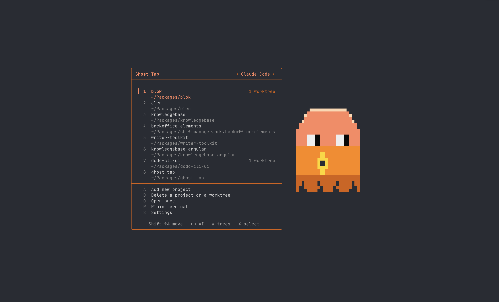
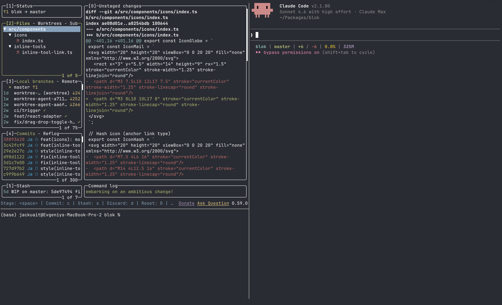

# Wisp Deck

Launch a ready-to-go AI coding session in one command. Wisp Deck opens a three-pane terminal workspace — your AI assistant, a live view of your git changes, and a spare terminal — and cleans everything up the moment you close the window.

<p>
  
  
</p>

---

## Quick Start

```sh
npx wisp-deck
```

That's it. The only requirements are **macOS** and **Node.js 16+**. Everything else — the terminal, your AI tool, and the supporting tools — is installed for you automatically the first time you run it.

On first launch you'll pick your AI assistant and add your projects. After that, opening a session is a couple of keystrokes.

---

## What You Get

Pick a project and Wisp Deck drops you into a three-pane workspace:

- **AI assistant** — Claude Code or OpenCode, focused and ready. Just start typing your prompt.
- **Changes view** — a live, auto-refreshing summary of what's changed in your branch (added/removed lines per file), or the full **lazygit** interface if you prefer.
- **Spare terminal** — a tabbed shell for running commands, with its own tab bar so you can open as many as you need.

Close the window and Wisp Deck shuts down every process it started — no leftover AI processes quietly running in the background.

> [!CAUTION]
> Closing the window force-stops everything in the session. Save your work first.

---

## Using the Project Selector

Open a new window and you're greeted by the selector:

```
⬡  Wisp Deck
──────────────────────────────────────

 1❯ my-app
    ~/Projects/my-app
  2 another-project
    ~/Projects/another-project
──────────────────────────────────────
  A Add new project
  D Delete a project or a worktree
  O Open once
  P Plain terminal
  S Settings        T Stats
──────────────────────────────────────
  ↑↓ navigate  ⏎ select
```

- **Arrow keys or mouse** to move, **Enter** or **click** to open
- **Number keys (1–9)** jump straight to a project
- **A** — add a project (with path autocomplete as you type)
- **D** — remove a project or one of its worktrees
- **O** — open a folder once without saving it to your list
- **P** — open a plain shell with no panes, just a terminal
- **S** — open Settings
- **T** — open Stats

### Git worktrees

Projects can expand to show their git worktrees. From the selector you can open a worktree like any project, create a new one from a branch picker (type `/` to search branches), or delete worktrees you're done with.

---

## Settings

Press **S** in the selector to open Settings. Changes apply immediately and reach every open session — no restart needed.

- **Theme** — Auto (matches your AI tool's colors) or a preset accent: Purple, Green, Blue, Rose, Orange.
- **Ghost** — show the animated mascot, a static one, or hide it.
- **Sound** — play a chime when the AI finishes and is waiting on you. Off by default; choose from the built-in macOS sounds.
- **Panel** — use the lightweight live **Changes** view or the full **lazygit** interface.
- **Tab title** — what the window tab shows: the project name, the AI tool's own title, or both.
- **Default projects folder** — the folder Wisp Deck starts in when you add a new project.
- **AI tool** — switch between Claude Code and OpenCode.

---

## Claude Accounts & Plans

If you use Claude Code, Settings also lets you manage **multiple logins** — keep separate work and personal accounts and switch between them without logging in and out each time. The active account is shown at the top of the menu; from the Login row you can add, rename, remove, and switch accounts.

You can also keep several **Claude configurations** and switch the active one per session.

---

## Stats

Press **T** in the selector for a usage dashboard. It breaks down your Claude usage by month — tokens used, a per-model breakdown, and estimated cost in USD — with a running total across everything. Handy for keeping an eye on what you're spending.

---

## Dropping Screenshots & Videos into the AI

Drag a screenshot or video from Finder or your desktop onto the AI pane and Wisp Deck hands it straight to your assistant — no copying paths by hand.

If a drag doesn't land where you expect, press **`Ctrl+b` then `i`** inside the session to inject your most recent screenshot directly into the AI pane.

---

## Status Line

For Claude Code, Wisp Deck sets up a compact status line so you always know where you stand:

```
my-project | main | S: 0 | U: 2 | A: 1 | 23.5%
```

- **Project** and **branch** you're on
- **S / U / A** — staged, unstaged, and newly added file counts
- **Context %** — how full Claude's context window is

> [!TIP]
> Watch the context percentage — when it climbs high, it's a good time to start a fresh conversation.

---

## Hotkeys

**In the terminal window:**

| Shortcut | Action |
|---|---|
| `Cmd+N` | New window (opens the selector) |
| `Cmd+T` | New tab |
| `Cmd+Shift+Left` | Previous tab |
| `Cmd+Shift+Right` | Next tab |
| `Left Option` | Acts as `Alt` instead of typing special characters |

**Inside a session** (press `Ctrl+b`, then the key):

| Shortcut | Action |
|---|---|
| `Ctrl+b` then `i` | Drop your latest screenshot into the AI pane |
| `Ctrl+b` then `t` | New tab in the spare terminal |
| `Ctrl+b` then `Tab` | Next spare-terminal tab |
| `Ctrl+b` then `Shift+Tab` | Previous spare-terminal tab |
| `Ctrl+b` then `w` | Close the current spare-terminal tab |

---

## Picking Up Where You Left Off

Reopen a project that's still running and Wisp Deck continues your last conversation instead of starting over. And after a reboot, the first time you launch it offers to bring back the projects you had open before — so a restart doesn't cost you your workspace.

---

## Staying Up to Date

Wisp Deck quietly checks for new versions and lets you know when one is available. To update, just run it again:

```sh
npx wisp-deck
```
